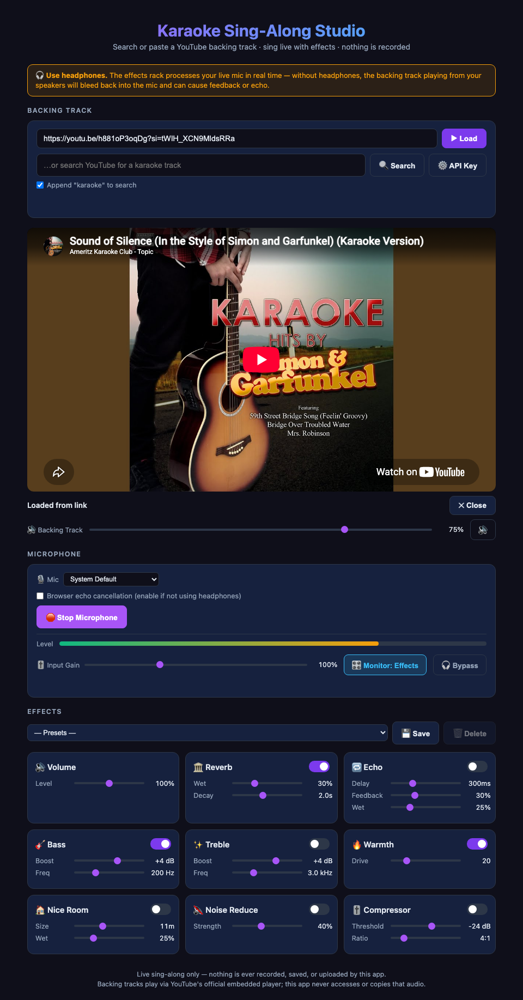

# Karaoke Sing-Along Studio

A single-file, browser-based karaoke companion. Search or paste a YouTube backing track, sing along into your microphone, and shape your voice live with a rack of real-time Web Audio effects — all client-side, with no server, build step, or install. **Nothing is ever recorded, saved, or uploaded** — this is a live sing-along tool, not a recorder.

**[▶ Try it live](https://kevin-enyuan-li.github.io/karaoke-studio/)** — runs immediately in your browser, no download needed.



## Why no recording?

This app deliberately stops short of recording or exporting anything, even though the effects engine it's built on ([voice-memo-studio](../voice-memo-studio)) fully supports it. Playing a video through YouTube's own embedded player is explicitly what YouTube's IFrame API is for — the stream comes straight from YouTube's servers, and general legal precedent (the "server test") puts responsibility for the video's own copyright status on whoever uploaded it and on YouTube as host, not on a page that merely embeds it. That protection stops the moment a page *captures* that audio into a new file, though — at that point you're creating a fixed copy of a backing track whose licensing you can't verify. Keeping this app playback-only, with the mic path fully separate from and never mixed with YouTube's audio, sidesteps that question entirely rather than relying on a disclaimer to paper over it.

If you want to record your own vocals (not the backing track), [voice-memo-studio](../voice-memo-studio) already does that safely — it only ever touches your microphone.

## Features

### Backing track
- **Load by link or video ID** — paste any YouTube URL format (`youtube.com/watch?v=`, `youtu.be/`, `/embed/`, `/shorts/`) or a bare 11-character ID and hit **▶ Load**. No API key needed for this path; playback goes through the official [YouTube IFrame Player API](https://developers.google.com/youtube/iframe_api_reference).
- **Search YouTube** for a track by name via the [YouTube Data API v3](https://developers.google.com/youtube/v3). This needs a free API key (search only — playback never needs one); paste it under **⚙️ API Key** and it's stored solely in this browser's `localStorage`, never sent anywhere but Google's API. Restrict the key by HTTP referrer in the Google Cloud Console before using it on a public page.
- **"Append karaoke" checkbox** appends the word to your search query automatically so results skew toward instrumental/karaoke versions.
- Friendly error messages for common embed failures: invalid video ID, embedding disabled by the video owner, video removed/private, and the app is opened as `file://` (YouTube refuses to authorize embeds on pages with no real origin).
- **🔊 Backing Track volume slider + mute** — controls the YouTube player's own volume via `setVolume()`/`mute()`, independent of your OS/speaker volume, so you can quickly balance the backing track against your mic level. Persists across sessions in `localStorage`.

### Microphone
- **🎙️ Mic device picker**, populated via `enumerateDevices()` (labels appear once mic permission is granted) and live-updated on `devicechange`.
- **Browser echo cancellation** toggle (off by default) — off gives the cleanest signal when you're on headphones; turn it on if you're not, since then the backing track really is leaking into the mic and the browser's own AEC can help.
- **🎚️ Input Gain** (0–300%), a `GainNode` applied before the level meter and the effects chain, persisted in `localStorage`.
- **Live level meter** driven by an `AnalyserNode` tapped straight off the gain-adjusted mic signal.
- Mic capture forces the signal down to a single real channel (`GainNode` with `channelCountMode: 'explicit'`, standard 0.5·(L+R) downmix) since some mics/headsets report 2 input channels but only actually wire the left one.
- **🔇/🎙/🎛 Monitor** cycles Off → Direct (mic → speakers, no processing, minimum latency) → Effects (full effects chain) → Off, on its own dedicated low-latency `AudioContext` (`latencyHint: 'interactive'`).
- **🎧 Bypass** — instant A/B compare that forces every effect off and volume to unity, so you can hear the dry mic vs. the fully-effected one without touching any sliders.

### Effects rack
All effects are the same native Web Audio nodes as voice-memo-studio, applied live to the monitored mic signal:

| Effect | Controls | Implementation |
|---|---|---|
| 🔊 Volume | Level (0–200%) | Input `GainNode` |
| 🏛️ Reverb | Wet, Decay | `ConvolverNode` fed a generated white-noise decay impulse response |
| 🔁 Echo | Delay, Feedback, Wet | `DelayNode` with feedback loop |
| 🎸 Bass | Boost (dB), Freq | Lowshelf `BiquadFilterNode` |
| ✨ Treble | Boost (dB), Freq | Highshelf `BiquadFilterNode` |
| 🔥 Warmth | Drive | `WaveShaperNode` with a generated soft-clip distortion curve |
| 🏠 Nice Room | Size, Wet | `ConvolverNode` fed a custom-synthesized impulse response with multi-tap early reflections + a diffuse tail |
| 🔇 Noise Reduce | Strength | A custom `AudioWorkletProcessor` ("noise-gate") that gates the signal below an envelope-following threshold |
| 🎚️ Compressor | Threshold (dB), Ratio | `DynamicsCompressorNode` for a "radio-ready" polish on the vocal |

Most sliders patch the live audio graph in place; changing Nice Room's Size or toggling Noise Reduce rebuilds the monitor chain instead, since a convolver's buffer and a worklet node can't be swapped live.

Effect settings auto-persist in `localStorage` (`ks_prefs_v1`). **Named presets** (dropdown + Save/Delete above the effects grid) let you save/recall full effect-rack configurations independently, stored under `ks_presets_v1`.

## Tech stack

- Plain HTML/CSS/JS — no framework, no bundler, no `npm install`.
- **YouTube IFrame Player API** for backing-track playback and volume control.
- **YouTube Data API v3** (optional, user-supplied key) for search.
- **Web Audio API**: `AudioContext`, `ConvolverNode`, `BiquadFilterNode`, `DelayNode`, `WaveShaperNode`, `DynamicsCompressorNode`, `AudioWorkletNode`.
- **MediaDevices API**: `getUserMedia` for mic capture, `enumerateDevices` for the device picker.
- **localStorage** for effect prefs/presets, input gain, and backing-track volume — nothing is ever sent to a server (aside from your own search queries going to Google's API, and video IDs going to YouTube, both directly from your browser).

## Project structure

```
karaoke-studio/
└── index.html   # Entire app: markup, styles, and JS in one file
```

## Running it

This app can't be opened as a plain `file://` page — both YouTube's embed API and the microphone/`AudioWorklet` APIs require a real origin. Serve the folder locally instead:

```bash
cd karaoke-studio
python3 -m http.server 8000
# or
npx serve .
```

then visit `http://localhost:8000` in your browser.

## Browser support notes

- **AudioWorklet** (used for Noise Reduce) requires a secure context (`https://` or `localhost`).
- **YouTube embedding** requires a real HTTP(S) origin — it will not work over `file://`, and the app detects this and shows a clear message instead of silently failing (YouTube's own "Error 153 / configuration error").
- If a specific video can't be loaded, it's usually because the uploader has disabled embedding for it — the app surfaces this as a friendly message with a "Watch on YouTube" fallback link in the player itself.
- **Use headphones.** Without them, the backing track playing from your speakers will bleed into the mic — with the effects chain live-monitoring that signal, this can cause audible feedback/echo, not just a muddy recording (there's no recording here to clean up afterward).
